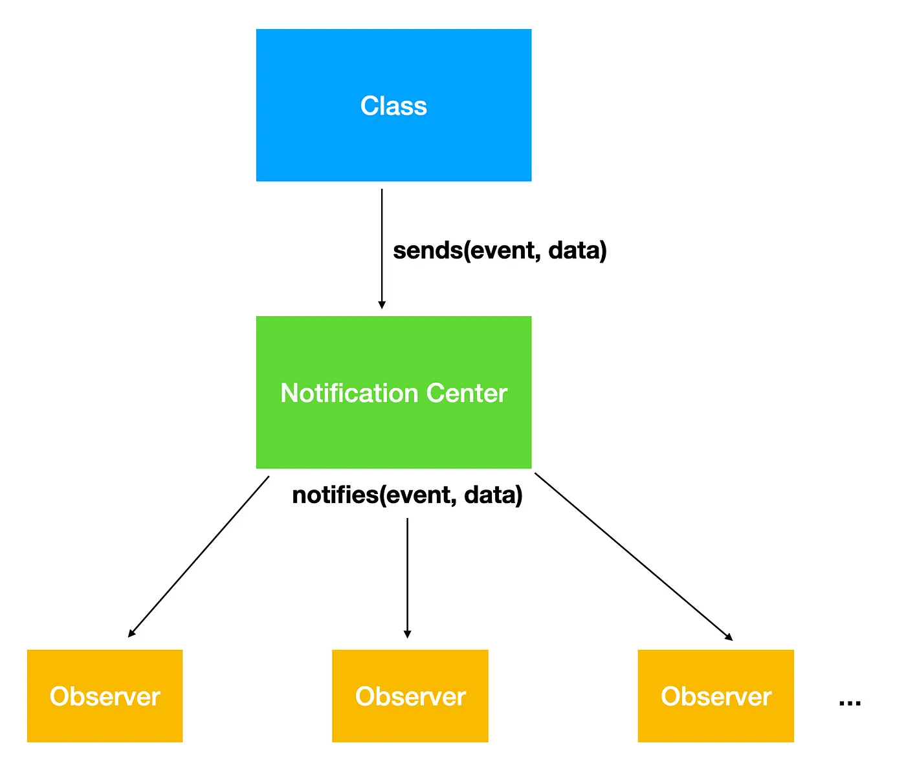

# Задачи на проектирование: кастомный Notification Center

* Что такое Notification Center
* Дефолтная реализация
* Улучшение реализации

Одна из частых задач, которую можно встретить — это написать свою реализацию Notification Center’а.

Почти каждый разработчик использовал NSNotificationCenter. Это очень полезный механизм подписок и подписчиков, который легко помогает передавать данные между экранами.
В статье будет 3 примера, которые иттеративно улучшаются в зависимости от поставленых требований: от худшего к лучшему.

В основе него лежит два паттерна: Singletone и Observer.

Паттерн Observer состоит наблюдаемого (Observable) класса, который генерирует события (events) и наблюдателей (Observers). Наблюдатели, которые на него подписаны, получают уведомления при генерации событий.



## Реализация

Как упоминалось ранее, наш пользовательский Notification Center будет синглтоном, только один экземпляр будет использоваться всеми, кто использует этот API в приложении.

```swift
final class CustomNotificationCenter {
    static private(set) var shared = CustomNotificationCenter()
    private var observers: [String: [String: [(String, Any?) -> ()]]] = [:]
  
    private init() {}
}
```

Каждый раз, когда нам нужно использовать MyNotificationCenter, мы будем обращаться к нему с помощью переменной MyNotificationCenter.shared.

## Добавление класса в качестве наблюдателя (observer)

Нам нужны методы, которые могут нам добавить класс в качестве наблюдателя.

Один класс может быть наблюдателем для нескольких уведомлений. Также может быть случай, когда несколько классов могут регистрироваться для одного и того же уведомления, но могут выполнять разные действия.

Таким образом, наш API addObserver будет принимать 3 параметра:

1. Class — экземпляр класса, который действует как наблюдатель.
2. Name - Название уведомления.
3. closure — это блок кода, который выполняется после запуска уведомления. Замыкание может содержать произвольный код, но оно всегда будет вызываться с двумя параметрами: именем уведомления и объектом — данными, которые мы хотим передать с уведомлением.

```swift
func addObserver<T: AnyObject>(
    _ inputClass: T,
    name: String,
    closure: @escaping (String, Any) -> ()
) {
    let className = String(describing: inputClass.self)
  
    if observers[className] != nil && observers[className]?[name] != nil {
        observers[className]?[name]?.append(closure)
    } else {
        observers[className] = [name: [closure]]
    }
}
```

## Отправка уведомления

Что происходит, когда мы отправляем уведомление? Вызываются все наблюдатели, наблюдающие за уведомлением с этим именем, и вызываются соответствующие блоки.

Когда кто-то публикует уведомление с этим именем и параметром объекта, мы просматриваем контейнер NotificationsStorage, находим все уведомления с этим именем и запускаем их одно за другим.

Если мы не сможем найти какой-либо блок уведомлений с таким именем, мы просто выдадим исключение NotFound.

```swift

func post(
    name: String,
    object: Any? = nil
) {
    for (_, names) in observers {
        for (observeName, closures) in names {
            guard name == observeName else { return }
  
            for observeClosure in closures {
                observeClosure(name, object)
            }
        }
    }
}
```

## Удаление наблюдателя

Наконец, мы можем захотеть удалить класс в качестве наблюдателя, чтобы предотвратить утечки памяти. Когда экземпляр класса удаляется из числа наблюдателей, он не получает никаких уведомлений. В нашем случае это довольно просто. У нас есть NotificationStorage как контейнер, в котором хранятся все данные уведомлений, связанные на верхнем уровне по имени класса. Таким образом, когда наблюдатель желает быть удаленным, он просто передает свой экземпляр методу RemoveObserver.

```swift
func removeObserver(_ _class: AnyObject) throws {
    let className = String(describing: _class)
  
    observers.removeValue(forKey: className)
}

```

Полный код

```swift
final class CustomNotificationCenter {
    static private(set) var shared = CustomNotificationCenter()
    private var observers: [String: [String: [(String, Any?) -> ()]]] = [:]
  
    private init() {}
  
    func addObserver<T: AnyObject>(
        _ inputClass: T,
        name: String,
        closure: @escaping (String, Any) -> ()
    ) {
        let className = String(describing: inputClass.self)
  
        if observers[className] != nil && observers[className]?[name] != nil {
            observers[className]?[name]?.append(closure)
        } else {
            observers[className] = [name: [closure]]
        }
    }
  
    func post(
        name: String,
        object: Any? = nil
    ) {
        for (_, names) in observers {
            for (observeName, closures) in names {
                guard name == observeName else { return }
      
                for observeClosure in closures {
                    observeClosure(name, object)
                }
            }
        }
    }
  
    func removeObserver(_ _class: AnyObject) throws {
        let className = String(describing: _class)
  
        observers.removeValue(forKey: className)
    }
}
```

## Улучшения

В примере выше есть две потенциальных проблемы:

* Нет потокобезопасности
* Проблемы с хранением неотписанных подписчиков

Давайте перепишем на код лучше

## Потокобезопасность

Главная проблема кода — это отсутствие потокобезопасности. Наш код будет просто крашиться

Одно из решений — добавить барьер

```swift
final class CustomNotificationCenter {
    static private(set) var shared = CustomNotificationCenter()
    private var observers: [String: [String: [(String, Any?) -> ()]]] = [:]
    private let notificationQueue = DispatchQueue(
	    label: "ios.makes.me.hate", attributes: .concurrent
    )
   
   ....
   
```

* Полный код
  ```swift
  final class CustomNotificationCenter {
      static private(set) var shared = CustomNotificationCenter()
      private var observers: [String: [String: [(String, Any?) -> ()]]] = [:]
      private let notificationQueue = DispatchQueue(label: "ios.makes.me.hate", attributes: .concurrent)

      private init() {}

      func addObserver<T: AnyObject>(
          _ inputClass: T,
          name: String,
          closure: @escaping (String, Any) -> ()
      ) {
          notificationQueue.async(flags: .barrier) {
              let className = String(describing: inputClass.self)

              if self.observers[className] != nil && self.observers[className]?[name] != nil {
                  self.observers[className]?[name]?.append(closure)
              } else {
                  self.observers[className] = [name: [closure]]
              }
          }
      }

      func post(
          name: String,
          object: Any? = nil
      ) {
          notificationQueue.async(flags: .barrier) {
              for (_, names) in self.observers {
                  for (observeName, closures) in names {
                      guard name == observeName else { return }

                      for observeClosure in closures {
                          observeClosure(name, object)
                      }
                  }
              }
          }
      }

      func removeObserver(_ _class: AnyObject) throws {
          notificationQueue.async(flags: .barrier) {
              let className = String(describing: _class)

              self.observers.removeValue(forKey: className)
          }
      }
  }
  ```

## Memory Safety

Нужно чтобы наш custom NC хранил подписчиков как слабую для обнуления ссылку

Это поможет для:

1. Никаких сбоев
2. Нет необходимости отменять регистрацию вручную.

Для начала создадим WeakObject — это объект, который будет хранить слабые ссылки

```swift
struct WeakObject<T: AnyObject>: Equatable, Hashable {
    private let identifier: ObjectIdentifier
    weak var object: T?
    init(_ object: T) {
        self.object = object
        self.identifier = ObjectIdentifier(object)
    }
  
    func hash(into hasher: inout Hasher) {
        hasher.combine(self.identifier)
    }
  
    static func == (lhs: WeakObject<T>, rhs: WeakObject<T>) -> Bool {
        return lhs.identifier == rhs.identifier
    }
}
```

Также создадим WeakObjectSet — он заменит нам массив

```swift
struct WeakObjectSet<T: AnyObject>: Sequence {
  
    var objects: Set<WeakObject<T>>
  
    init() {
        self.objects = Set<WeakObject<T>>([])
    }
  
    init(_ object: T) {
        self.objects = Set<WeakObject<T>>([WeakObject(object)])
    }
  
    init(_ objects: [T]) {
        self.objects = Set<WeakObject<T>>(objects.map { WeakObject($0) })
    }
  
    var allObjects: [T] {
        return objects.compactMap { $0.object }
    }
  
    func contains(_ object: T) -> Bool {
        return self.objects.contains(WeakObject(object))
    }
  
    mutating func add(_ object: T) {
        //prevent ObjectIdentifier be reused
        if self.contains(object) {
            self.remove(object)
        }
        self.objects.insert(WeakObject(object))
    }
  
    mutating func add(_ objects: [T]) {
        objects.forEach { self.add($0) }
    }
  
    mutating func remove(_ object: T) {
        self.objects.remove(WeakObject<T>(object))
    }
  
    mutating func remove(_ objects: [T]) {
        objects.forEach { self.remove($0) }
    }
  
    func makeIterator() -> AnyIterator<T> {
        let objects = self.allObjects
        var index = 0
        return AnyIterator {
            defer { index += 1 }
            return index < objects.count ? objects[index] : nil
        }
    }
}
```

Поменяем хранимые объекты в нашем NC

```swift
final class CustomNotificationCenter {
    static private(set) var shared = CustomNotificationCenter()
    private var observers: [String: Any] = [:]
    ....
 }
```

И изменим методы по работе с NC

1. Меняем подписку на слушатель регистрацией

```swift
 func register<T>(
        _ inputClass: T.Type,
        observer: T
    ) {
  
    notificationQueue.async(flags: .barrier) {
        let key = "\\(inputClass)"
        if var set = self.observers[key] as? WeakObjectSet<AnyObject> {
            set.add(observer as AnyObject)
            self.observers[key] = set
        } else{
            self.observers[key] = WeakObjectSet(observer as AnyObject)
        }
    }
}
```

1. А также слушатель заменяем уводемлением

```swift
func notify<T>(
    _ _class: T.Type,
    block: (T) -> Void
) {
    let key = "\\(_class)"
    var objectSet: WeakObjectSet<AnyObject>?
    notificationQueue.sync {
        objectSet = self.observers[key] as? WeakObjectSet<AnyObject>
    }
  
    guard let objects = objectSet else { return }
  
    for observer in objects {
        if let observer = observer as? T {
            block(observer)
        }
    }
}
```

Как использовать?

Для подписки события нам нужно создавать протокол, который будет классом слушателя

```swift
protocol TestProto: AnyObject {
    func changeLink(test: String)
}

class ViewController: UIViewController, TestProto {
    override func viewDidLoad() {
        super.viewDidLoad()
  
        DispatchQueue.main.async {
            let vc = ViewController2()
  
            self.present(vc, animated: true)
        }
  
        CustomNotificationCenter.shared.register(TestProto.self, observer: self)
    }
  
    @objc func changeLink(test: String) {
        print(test)
    }
}
```

Для нотификации этот протокол будет ключем

```swift
class ViewController2: UIViewController {
    override func viewDidLoad() {
        super.viewDidLoad()
  
  
        CustomNotificationCenter.shared.notify(TestProto.self) { test in
            test.changeLink(test: "test")
        }
    }
}

```

Ресурсы:

[Implementing a Custom NotificationCenter Efficiently in iOS](https://betterprogramming.pub/ios-implementing-a-custom-notification-center-manually-in-the-most-efficient-way-e6b86a4bee80)

[Custom Local Notification center in Swift](https://medium.com/@jeevaneashwar2/custom-local-notification-center-in-swift-2f341f1dba1c)

[How to implement custom NotificationCenter in Swift](https://jayeshkawli.com/implementing-nsnotificationcenter-in-swift/)

[Сделай кастомный Notification Centre для iOS приложения. Пиши код на языке...](https://www.perplexity.ai/search/Notification-Centre-iOS-wvj79s_HTEKZOc.nQCgPtQ)
